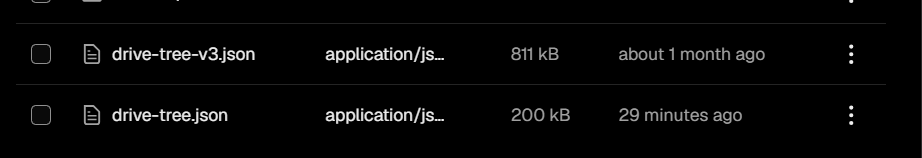

## index.js - Indexador de Google Drive

Este script se encarga de recorrer una carpeta de Google Drive de forma recursiva, construir un árbol con todas sus carpetas y archivos, y guardar el resultado como un archivo JSON en Vercel Blob, no se guarda en local.

El objetivo es que la aplicación pueda consultar posteriormente este árbol sin tener que recorrer Google Drive cada vez que un usuario navega por los apuntes.

el drive-tree-v3.json es el más importante el que siempre se muestra , el index.js solo modifica el drive-tree.json que recopila todo lo del drive para luego fusionarlo con drive-tree-v3.json que además del drive guarda links a archivos de otros drives, por seguridad del drive-tree-v3.json de evitar perder archivos se realiza un merge con (merge-drive.js) para tener siempre actualizada nuestro drive-tree-v3